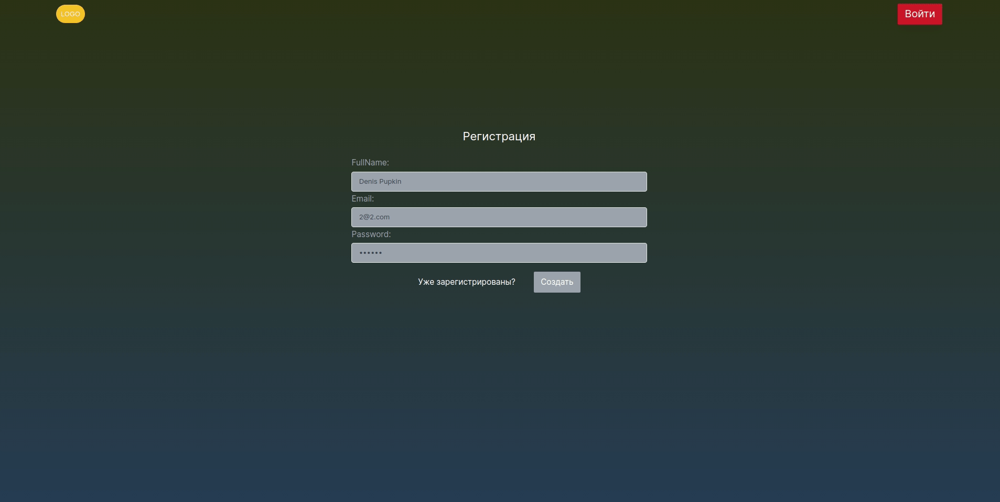
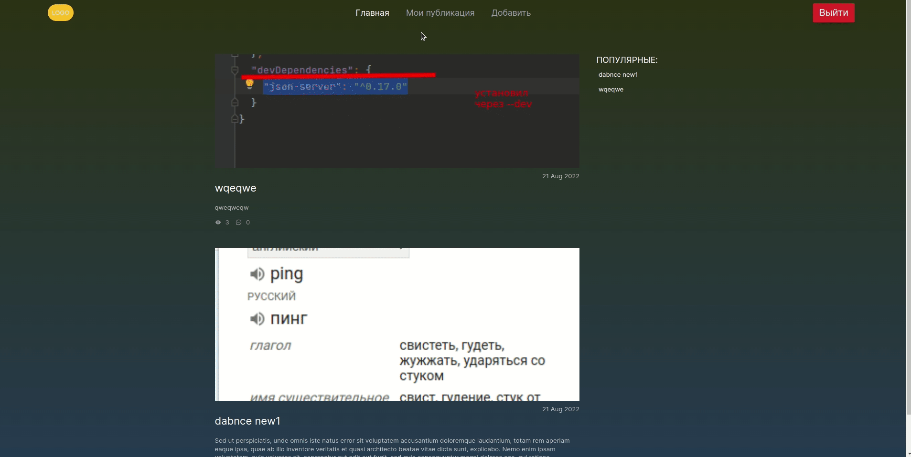

# Стек(mongodb, express, node,react)
___

___
## Пример небольшого сайта, где мы можем создавать и публиковать публикации,загружать изображение,где присутсвует реагистрация и авторизация
Это проект с серверной и клиентской частью, с акцентом на функциональную часть(есть не большие недоработки).
Проект создан с на базе такого стека, как  MERN(Mongodb, Express, React, Node). Также создан на основе Tailwind.css


#### Для старта необходимо подключиться к базе данных:
```
git clone https://github.com/deniskots/react-cload.git
yarn
yarn server
yarn start
```
___
## Авторизация и регистрация(Bcrypt, jsonwebtoken)
При первом рендере страницы проверяем авторизован пользователь или нет,что дает нам доступ к удалению, созданию и редактированию публикаций


___

___
## Создание публикаций 
Загрузка изображений с помощью express-fileupload
___

